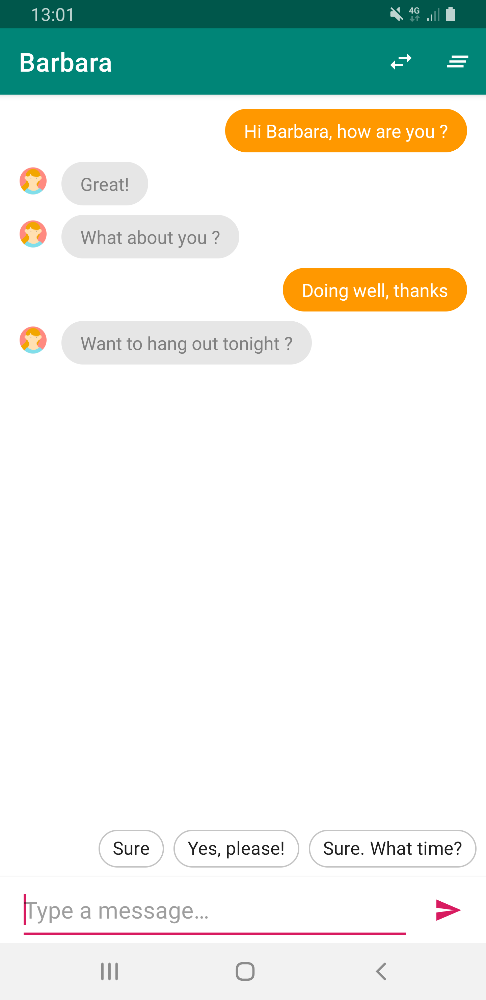

# Simply generate Smart Replies with ML Kit on Android using Java

This sample shows how to simply generate Smart Replies with ML Kit on Android using Java. 

This project is used in the related [course on Udelabs](https://udelabs.com/2019/04/07/how-to-simply-generate-smart-replies-with-ml-kit-on-android/).

Udelabs is a platform dedicated to Android development learning. Udelabs helps you to build great Android apps relying on free and high-quality courses.

Follow us on :
Facebook: https://www.facebook.com/Udelabs-470829673738867
Twitter: https://twitter.com/Udelabs1
